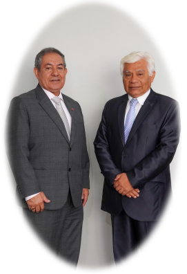

"INGENIEROS POR EL GRAN CAMBIO"  

  

####  Soy el Dr. Hugo Chirinos, Ingeniero Químico (CIP-110818), Presidente electo del Capitulo de Químicos-geólogos-metalúrgicos y afines del Colegio de Ingenieros del Perú Consejo Provincial del Callao

- 🔭 Actualmente trabajo en la UNI como Docente-Investigador. Ocupo el cargo de Director de la Unidad de Investigación de la FIA (Facultad de Ingeniería Ambiental)
- 📫 Formo parte del selecto grupo de investigadores del CONCYTEC ocupando el NIVEL IV del RENACyT

  
- ⚡  LOS DIRECTIVOS DE MI LISTA SON:
    - Vice-Presidente: Mario Francisco Carpio Ronquillo
    - Secretaria: Susana Elizabeth Gonzales Carbajal
    - Pro-secretario: Raúl German Pizarro Cabrera
    - Vocal 1: Elmer Boulangger Rondoy
  

  
  
  
  
 

